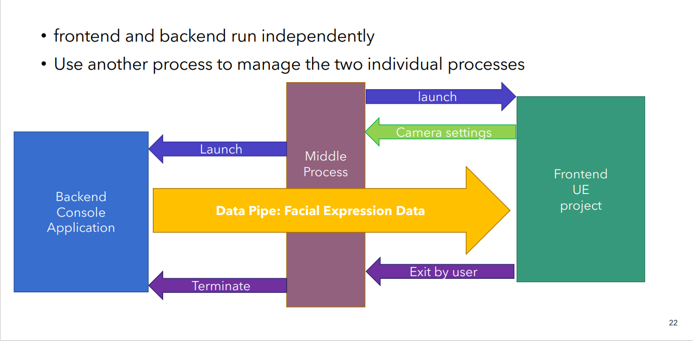
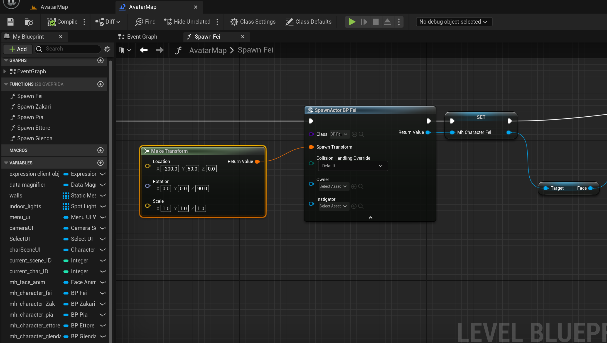
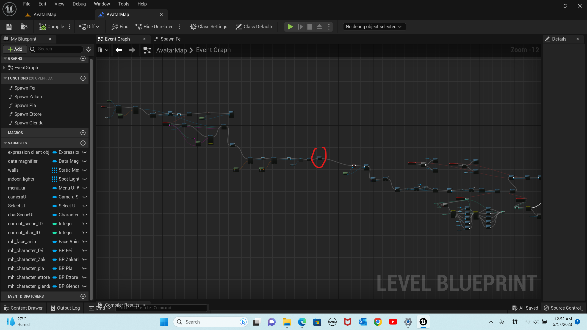
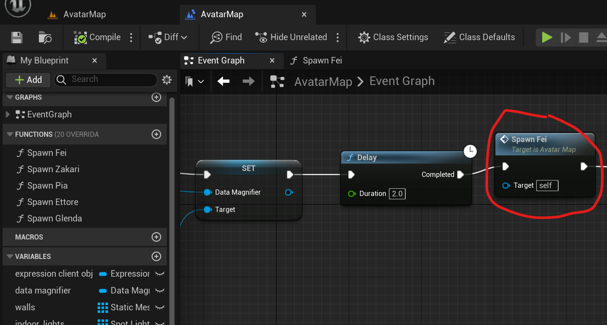
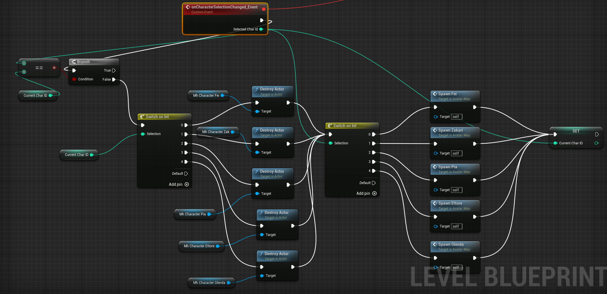

# Magic Mirror

**Magic Mirror** is an integrated application for real-time facial expression replication. 

It's facial expression recognition is modified from [NVIDIA's Maxine AR SDK](https://github.com/NVIDIA/MAXINE-AR-SDK), and its character models are created using [MetaHuman Creator](https://metahuman.unrealengine.com/), animated in [Unreal Engine 5](https://www.unrealengine.com/en-US/unreal-engine-5).

This repository only includes some C++ souce codes.

The link to download the standalone application is below:
https://drive.google.com/file/d/1ByrWAf4yFT-8sPiEUuR8Lsng8WpvPsGO/view?usp=sharing

The whole frontend Unreal Engine project can be downloaded below:
https://drive.google.com/file/d/11-MScPsGtXH7IFHSEe1vB_v-s6AjnheF/view?usp=share_link

This project is open for downloading, modifying, extension, and sharing, as long as providing a link of this GitHub Repository at a reasonable position.
 
 

# Set up

You can try the built standalone application if your computer meets the requirements below:

**Operating System:** 64-bit Windows 10 or later

**Hardware Requirements:** NVIDIA Graphics Driver for Windows (511.65 or later)  
*i.e. NVIDIA GeForce RTX 20XX and 30XX Series, Quadro RTX 3000, TITAN RTX, or higher (any NVIDIA GPUs with Tensor Cores) should all work. For detailed requirements, please check [NVIDIA/MAXINE-AR-SDK](https://github.com/NVIDIA/MAXINE-AR-SDK) and [Maxine | NVIDIA NGC](https://catalog.ngc.nvidia.com/orgs/nvidia/teams/maxine/collections/maxine)*

The link to download the standalone application is below:
https://drive.google.com/file/d/1ByrWAf4yFT-8sPiEUuR8Lsng8WpvPsGO/view?usp=sharing

You can run it by simply click the MagicMirror.exe at the root directory.
 
 

# Overall Structure

The project is integrated by a backend console process that recognizes the user's facial expressions in real-time and a frontend Unreal Engine project that animated the virtual character, both launched by a medical process. Meanwhile, the real-time facial expression data is transferred from the backend to the frontend through a Windows Named Pipe.

 
 

# Backend Facial Expression Recognition

The real-time facial recognition backend is modified based on the [Expression Sample Application](https://github.com/NVIDIA/MAXINE-AR-SDK/tree/master/samples/ExpressionApp) in [NVIDIA's Maxine AR SDK](https://github.com/NVIDIA/MAXINE-AR-SDK), by modifying its expressionApp.cpp, run.bat and add a new PipeServer.cpp. 
These modified or added files above are provided in [backend_expression_recognition](https://github.com/Li-Jiayi-hahaha/Magic_Mirror/tree/main/backend_expression_recognition).

The expressionApp is modified to remove unneccessary functions, and the PipeServer manages to send out facial expression data in real-time.
 
 

## Modify the backend
 

If you want to modify the backend program and re-compile it. Please follow the steps below:

**1, download the [NVIDIA's Maxine AR SDK](https://github.com/NVIDIA/MAXINE-AR-SDK), re-compile and run it by following their instructions.**

To run their built executions, you may follow the instructions in this video: [How To Install Eye Contact AI | NVIDIA MAXINE | Gaze Redirect - YouTube](https://www.youtube.com/watch?v=LqiFEhnnA9I&list=PLNBwQu8YkHiM2iMLYaG7Y4zm_fys4WzHI&index=41)  
To re-compile their applications, I found this Chinese blog is quite detailed and helpful: [Nvidia Maxine 精讲 啥都会一点的老程-CSDN博客](https://blog.csdn.net/weixin_44119362/article/details/127242279)

**2, Modify some files in the ExpressionApp**

copy the filed in ExpressionApp.cpp, PipeServer.cpp and run.bat file in the [backend_expression_recognition](https://github.com/Li-Jiayi-hahaha/Magic_Mirror/tree/main/backend_expression_recognition) folder and paste them to the samples/ExpressionApp folder in your downloaded Maxine-AR-SDK repository.
Then you can modify the source codes and re-compile the whole repository in the same way explained in step 1.
Please ensure that the ExpressionApp.exe is at the same path.

**3, Move to the Standalone Application**
Replace the Maxine_AR_SDK directory in the Standalone Application with your own Maxine-AR-SDK repository, renaming it as "Maxine_AR_SDK".
Then the application should still work by clicking the MagicMirror.exe in the standalone application.
 
 

# Frontend Unreal Engine Project
 

The frontend application is developed in Unreal Engine 5.1, with virtual characters exported from MetaHuman created. 

While some C++ programs (shared in [frontend_unreal_engine](https://github.com/Li-Jiayi-hahaha/Magic_Mirror/tree/main/frontend_unreal_engine) folder) is used to receive real-time facial expression from the data pipe and update the variables accordingly, most of the User Interface logics are implemented in Blueprints, which are not included in this repository.

The whole Unreal Engine project can be downloaded below:
https://drive.google.com/file/d/11-MScPsGtXH7IFHSEe1vB_v-s6AjnheF/view?usp=share_link

## Add custom the character

You can add your own MetaHuman character to this project follow the steps below.

1, Install Unreal Engine Editor, and **launch this Unreal Engine project**.

2, Follow this video to **create the MetaHuman virtual character and export it to this UE project**: [Creating and Importing A MetaHuman into Unreal Engine 5 - YouTube](https://www.youtube.com/watch?v=ICJ_Y4GwZqM) without adding the character to the game scene. 
*For advance users, you may use some 3rd-party applications to create the chracter mesh and then export it to MetaHuman.*

3, **Edit the level Blueprint of Avatar Map**. 

(i) create a new function and copy the contents in "Spawn Fei" to this function, replace the class in "Spawn Actor" node to the blueprint of newly added MetaHuman, and create a variable to store this actor using the "set" node. You may also adjust the "location Z" in transformation node according to the height of the character.

 
 

(ii) replace the "Spawn Fei" node in this level blueprint with your newly-created function 
The location of this node is shown below.

 
The detailed view is below.

(iii) After the two steps above and re-complie the level blueprint, the application should spawn your own character at the beginning.  

However, if you also want to enable the character selection, please modify the UI widget in Content/StarterContent/MenuUI/Character_Scene, and the modify this part in level blueprint:

 
 

# Middle Process

The middle process is indeed the source codes of "MagicMirror.exe". It's provided in [middle_process](https://github.com/Li-Jiayi-hahaha/Magic_Mirror/tree/main/middle_process) folder as the "backendMgr.cpp".
You can modify the source code and re-compile it for your reference.
